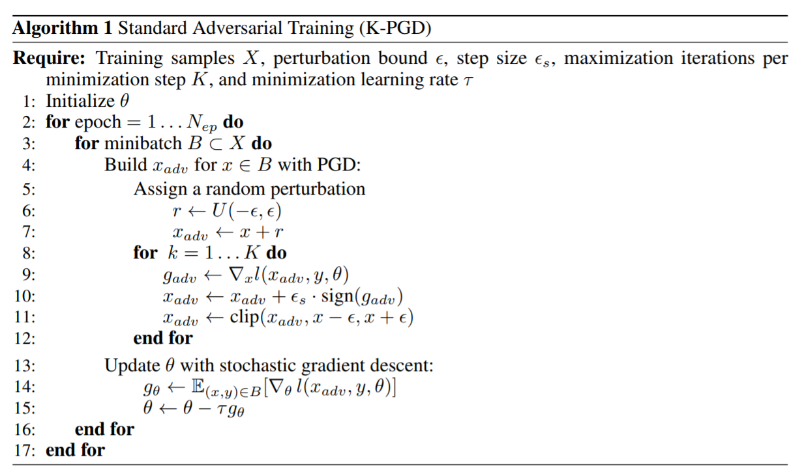
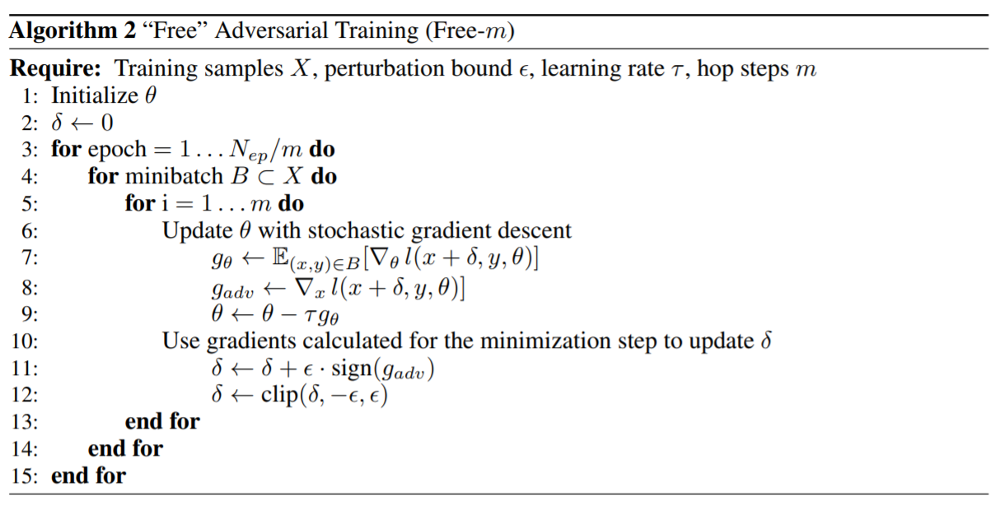

<head>
    
    
</head>

>提示：在github中无法正常显示公式，download repo到本地用markdown打开可以正常显示，也可以使用[GitHub with MathJax](https://chrome.google.com/webstore/detail/mathjax-plugin-for-github/ioemnmodlmafdkllaclgeombjnmnbima/related)插件来解决此问题

# 对抗样本训练
## [Adversarial Training for Free!](https://arxiv.org/pdf/1904.12843.pdf)
看到文章标题都觉得作者是不是有吹牛皮嫌疑，不过确实很吸引人，对抗样本，对抗攻击这块在deeplearning产品落地这块的应用的确有很长的路走，所以把这篇文章看看。
文章期望解决的问题是对抗样本在生成过程中，如果要得到有很强对抗性的样本，往往需要多次的反sgd迭代才能完成，而这样生成对抗样本的方式，决定了这类办法无法应用于大规模的任务(如imagenet)，目前解决方法主要有：
> #训练一个GAN来生成对抗样本，这类办法的缺点主要是GAN无法生成对于imagenet覆盖度好，表征力强的样本
> #还有是训练过程中对lab做smooth，jacobian正则等等
但上述工作都并没有在大规模任务中有较好的结果
下面可以对比一下一般对抗样本的生成和本论文提出的'Free'方法的区别
### baseline算法

### Free算法

对比两个算法后发现，“Free”这个方法主要作用的点在于，baseline相当于是直接从Uniform分布中采样了一个noise，模型来判断调节这个noise的正负，不调节其大小；而Free方法，的改进之处在于，noise不是Random采样处理的，而是利用历史反向梯度tune出来的，这样可能会产生更强的对抗性吧