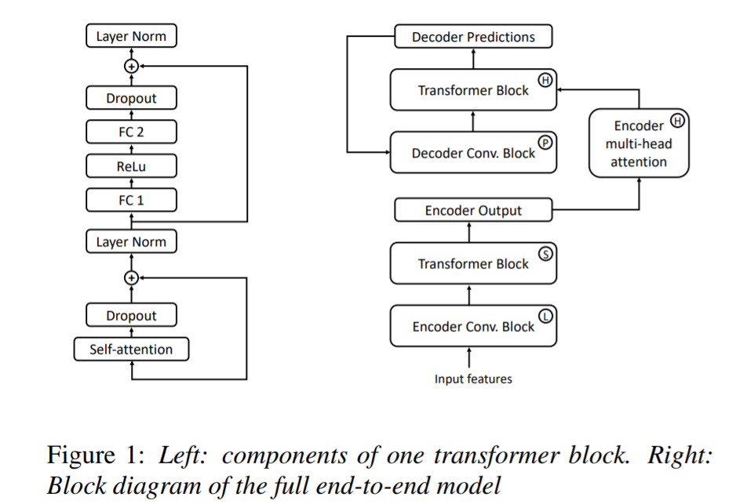

<head>
    
    
</head>

>提示：在github中无法正常显示公式，download repo到本地用markdown打开可以正常显示，也可以使用[GitHub with MathJax](https://chrome.google.com/webstore/detail/mathjax-plugin-for-github/ioemnmodlmafdkllaclgeombjnmnbima/related)插件来解决此问题

# [Very Deep Self-Attention Networks for End-to-End Speech Recognition](https://arxiv.org/pdf/1904.13377.pdf)

这篇文章算是少数用纯transformer来做ASR的了，结果还算不错，有几个结论值得借鉴：
> #transformer的层数一定要足够深，论文中的层数都达到了48层(encoder尤其需要更深一些，encoder用了36层，decoder用了12层)；同时，作者做了另外的实验，把层数减少一半，模型节点数目double，发现性能掉了挺多，说明transformer的确需要更深一些，而不是模型容量大就足够

> #为了防止transformer过拟合，中间的一些drop，stochastic layers的设计也挺重要
作者的工作目测还是很solid的，[代码](https://github.com/quanpn90/NMTGMinor/tree/audio-encoder/)可循

# [AISHELL-2: Transforming Mandarin ASR Research Into Industrial Scale](https://arxiv.org/pdf/1808.10583.pdf)
国内一家专注做语音交互的公司[希尔贝克](http://www.aishelltech.com/sy)release的1000h的中文语音数据，非常高的质量，数据量也足够大，并且作为学术研究可以免费申请

# [Hard Sample Mining for the Improved Retraining of Automatic Speech Recognition](https://arxiv.org/pdf/1904.08031.pdf) 
作者的出发点我觉得还是可以的，使用一种类似半监督的方式，来进行数据筛选。
流程如下：
> 1.使用300h SB数据训练End2End的ASR系统

> 2.使用100h的Fisher数据，送入ASR中，得到识别结果$\hat y$，同时也有golden $y$，再训练一个模型，分辨$\hat y$和$y$。再使用500h的Fisher语料，一个是随机挑的，一个是"hard" samples的数据，然后发现这种"harde"语料的性能比随机挑选的更好

文章的出发点我还是很认可，不过论文中有很多关键步骤根本没有讲清楚，所以我觉得有2种原因: 1.中间的trick作者并不愿意详细讲出来；2.另外一种嘛，emmmm

# [Automatic Spelling Correction with Transformer for CTC-based End-to-End Speech Recognition](https://arxiv.org/pdf/1904.10045.pdf)
多阶段的ASR模型，首先训练一个 “声学模型”，再训练一个纠错模型

# [Sequence-to-Sequence Speech Recognition with Time-Depth Separable Convolutions](https://arxiv.org/pdf/1904.02619.pdf)
Facebook家做ASR的一篇文章，这篇文章的一个亮点是使用time-depth separable convolution
其中TDS网络结构主要有下面3个部分网络组成

论文使用了很多的一些工程trick，这些trick主要有以下几个方面
### Decoder
去除了scheduled sampling, input feeding, location-based attention等时序相关的的一些操作，这样在训练过程中，由于是teacher-forcing的，所以无需等待，直接一并算完，调cudnn的RNN，节省多次调研kernel的开销，并且attention使用的也是点积attnetion
### Random samping
Decoder端的token使用了很少比例的random sampling以此来缓解训练和将来解码的mismatch和overfitting
### Soft window pre-training

其中$W_{ij}=(i-\frac{T}{U}j)$用于约束attention的大致范围，加速收敛
### Regularization
#### Dropout
#### label smoothing
使用的是0.05的smooth factor
#### word piece sampling
decoder端的分词不仅仅是BPE的argmax，而是多组后续 on-the-fly进行，缓解过拟合，增加模型泛化能力
### BeamSearch的稳定性trick
#### attention限制
当前attention的peak离上一个attention peak 不能相隔太远
#### EOS
要大于一个threshold才结束防止句子过短

总体来说，这篇文章也算是干货满满的

# [Transformers with convolutional context for ASR](https://arxiv.org/pdf/1904.11660.pdf)
又是Facebook家做的ASR的一个工作，这个工作非常简单粗暴，就是用transformer来做ASR，一个非常重要的就是，不再向NMT那样使用Position Embedding，而是使用几层卷积代替position embedding，然后再累深层的transformer；实验结论是Encoder端需要多层transformer，Decoder端有6~8层就够了
网络结构图为

