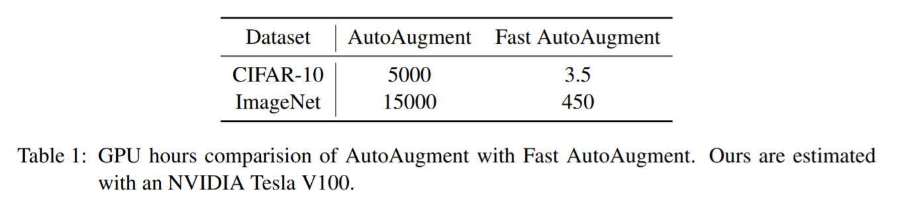
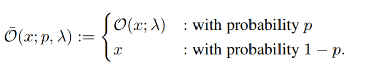
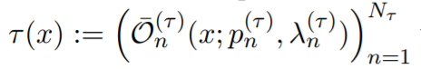
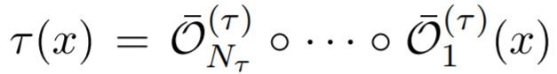
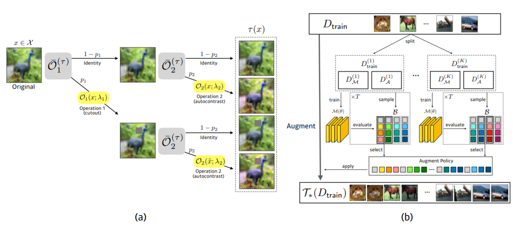
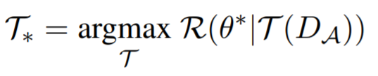
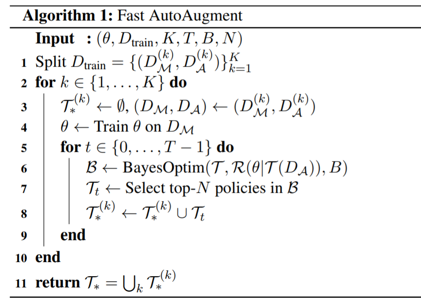
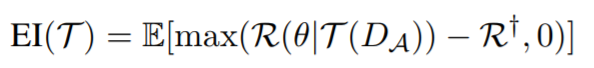

<head>
    
    
</head>

>提示：在github中无法正常显示公式，download repo到本地用markdown打开可以正常显示，也可以使用[GitHub with MathJax](https://chrome.google.com/webstore/detail/mathjax-plugin-for-github/ioemnmodlmafdkllaclgeombjnmnbima/related)插件来解决此问题
# 数据增强论文阅读

## [SpecAugment: A Simple Data Augmentation Method for Automatic Speech Recognition](https://arxiv.org/pdf/1904.10045.pdf)

文章来自google brain，做的方法非常简单粗暴有效，自己在输入的mel spectrogram中进行数据增强，增强的方式也很简单，将mel spectrogram看作2D的语谱图，在time domain 和 frequency domain进行抹除操作，具体可以看下图所示

## [Unsupervised Data Augmentation](https://arxiv.org/pdf/1904.12848.pdf)

文章依然来自google和carnegie大学的合作，主要探索了如何使用无监督数据来进行数据增强，这篇文章可以认为是在[Takeru Miyato](https://arxiv.org/pdf/1704.03976.pdf)工作上面的一个升级版本。
这边文章的related work里面对于数据增强还是有非常好的描述的，这些数据增强的方式，可以统一成如下的framework

其中，$\hat x$表示数据增强的样本，$y^*$表示$x$对应的label。
从上面的framework来看，这类的数据增强在无论是语音，图像(crop, resize, flip等)，NLP(BERT)都是非常广为人知的操作了，但是这类方法，也仅仅是适用于有监督，无监督的进行数据增强的方法，可以参考[Takeru Miyato](https://arxiv.org/pdf/1704.03976.pdf)的文章，这篇文章做的工作总结成一个公式

在训练的过程中， supervised data使用label的CE进行优化
unsupercised data使用KL进行优化
论文中的data augument strategies有以下几个方面
> Image Classification
>> [AutoAugument](https://arxiv.org/abs/1805.09501) 这篇文章用了强化学习的方式来挑选data augument的策略，reward是开发集上面的Acc, Policy是以下crop, resize 或者光照，颜色等数据增强方式，感觉主要是这类方式能够比较好的补充开发集相对训练集比较薄弱的一些数据分布

>> [Cutout](https://arxiv.org/abs/1708.04552) 这个在image上面貌似是一个非常流行的正则手段，看论文看到了多次，这个正则手段非常简单，就是在图片中随机扣一个方块，如下图所示 

> Text Classification
>> [BackTranslation](https://arxiv.org/pdf/1511.06709.pdf) 在NMT里面，算是最简单，粗暴有效的一个策略了。说到backtranslation，这篇文章的作者[Rico Sennrich](http://homepages.inf.ed.ac.uk/rsennric/)挺有意思的，在翻译里面的BPE和Backtranslation，均是他提出，都是非常简单，又非常有效的，挺让人佩服的。之前一直把back-translation和dual learninig搞得傻傻分不清，看了back-translation论文，发现back-translation最初使用单语语料仅仅是在decoder端使用，encoder是empty输入，并且单语训练梯度只更新decoder，单语训练和平行语料一起组batch训练，为了解决蹩脚问题，让一个翻译器先把单语语料粗翻一下，然后就可以当做平行语料来和正常平行语料一起使用

>> TF-IDF based word replaceing

文章还有一个亮点，为了解决无监督数据和有监督数据不匹配的问题，提出了Training  Signal Annealing(TSA的方法。出发点是，模型容量过大，有监督必然overfitting，模型容量小了又不能较好地利用大量的无监督data。这个做法的简单描述是，对于有监督样本预测的posterior，当正确probability>$\eta_t$时，把loss给mask掉；并且$\eta_t$随着训练步数的增加，从$\frac{1}{V}$逐渐增大到1，使得有监督信号不会一开始就dominate模型，过拟合，而对无监督数据照顾不care

# [Fast AutoAugment](https://arxiv.org/pdf/1905.00397.pdf)

文章主要是在[AutoAugment](https://arxiv.org/pdf/1805.09501.pdf)基础上展开的工作，解决AutoAugment对计算量要求巨大的问题。下图是文章的一个效率对比

而且看最终效果也相比AutoAugument有比较明显的提升。文章的思路框架是，给定网络结构后，优化数据增强的policies，通过数据增强的方式，可以把训练集分布比较薄弱的数据给补充起来，从而增加在开发集的泛化效果。假设$O$表示一个augument的Operation，则数据增强方式可以表示为

每个sample是可能经过$N_{\tau}$次data augument的，这个过程可以表示为：

串起来的表示为:

模型最终优化出一个数据增强的policy ${T}$，由一个数据增强方式的序列组合而成，可以参考

这里简单再描述这篇论文，或者所以auto augument论文的思路，都是希望通过数据增强的方式，使得$D_{train}$分布跟$D_{validation}$更加靠近，而得到在$D_{validation}$的性能提升。这篇文章的具体做法；首先将$D_{train}$分成K-fold，每个folder的数据都包括2个部分($M$和$A$)，模型参数为$\theta$，优化目标为

其中$M$用于优化模型参数$\theta$，$A$用于优化数据增强的policy $T$，最终模型可以做的是的$D_M$和$T(D_A)$的分布一致，即收敛，整个算法流程如图

文章的核心关键就在于如何优化算法第6行中的BayesOptim算法了，作者使用了Expected Improvement(EI)准则进行优化，具体表示如下

文章作者说的使用的tree-Structed Parzen estimator(TPE)算法，使用的HyperOpt库，这部分后面作者会开源[代码](https://github.com/kakaobrain/fast-autoaugment)