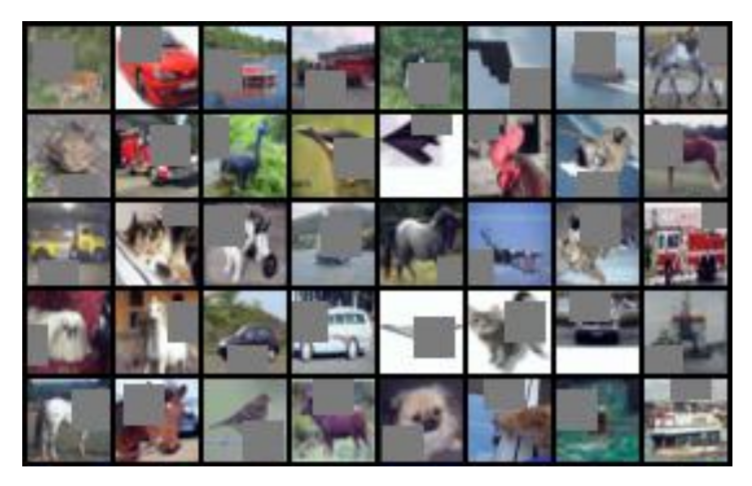

<head>
    
    
</head>

>提示：在github中无法正常显示公式，download repo到本地用markdown打开可以正常显示，也可以使用[GitHub with MathJax](https://chrome.google.com/webstore/detail/mathjax-plugin-for-github/ioemnmodlmafdkllaclgeombjnmnbima/related)插件来解决此问题
# 数据增强论文阅读

## [SpecAugment: A Simple Data Augmentation Method for Automatic Speech Recognition](https://arxiv.org/pdf/1904.10045.pdf)

文章来自google brain，做的方法非常简单粗暴有效，自己在输入的mel spectrogram中进行数据增强，增强的方式也很简单，将mel spectrogram看作2D的语谱图，在time domain 和 frequency domain进行抹除操作，具体可以看下图所示

## [Unsupervised Data Augmentation](https://arxiv.org/pdf/1904.12848.pdf)

文章依然来自google和carnegie大学的合作，主要探索了如何使用无监督数据来进行数据增强，这篇文章可以认为是在[Takeru Miyato](https://arxiv.org/pdf/1704.03976.pdf)工作上面的一个升级版本。
这边文章的related work里面对于数据增强还是有非常好的描述的，这些数据增强的方式，可以统一成如下的framework

其中，$\hat x$表示数据增强的样本，$y^*$表示$x$对应的label。
从上面的framework来看，这类的数据增强在无论是语音，图像(crop, resize, flip等)，NLP(BERT)都是非常广为人知的操作了，但是这类方法，也仅仅是适用于有监督，无监督的进行数据增强的方法，可以参考[Takeru Miyato](https://arxiv.org/pdf/1704.03976.pdf)的文章，这篇文章做的工作总结成一个公式

在训练的过程中， supervised data使用label的CE进行优化
unsupercised data使用KL进行优化
论文中的data augument strategies有以下几个方面
> Image Classification
>> [AutoAugument](https://arxiv.org/abs/1805.09501) 这篇文章用了强化学习的方式来挑选data augument的策略，reward是开发集上面的Acc, Policy是以下crop, resize 或者光照，颜色等数据增强方式，感觉主要是这类方式能够比较好的补充开发集相对训练集比较薄弱的一些数据分布
>> [Cutout](https://arxiv.org/abs/1708.04552) 这个在image上面貌似是一个非常流行的正则手段，看论文看到了多次，这个正则手段非常简单，就是在图片中随机扣一个方块，如下图所示 
> Text Classification
>> [BackTranslation](https://arxiv.org/pdf/1511.06709.pdf) 在NMT里面，算是最简单，粗暴有效的一个策略了。说到backtranslation，这篇文章的作者[Rico Sennrich](http://homepages.inf.ed.ac.uk/rsennric/)挺有意思的，在翻译里面的BPE和Backtranslation，均是他提出，都是非常简单，又非常有效的，挺让人佩服的。