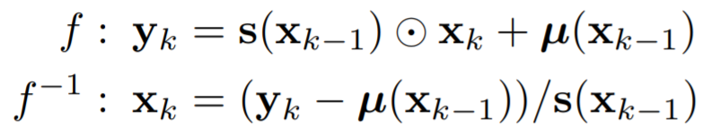

<head>
    
    
</head>

>提示：在github中无法正常显示公式，download repo到本地用markdown打开可以正常显示，也可以使用[GitHub with MathJax](https://chrome.google.com/webstore/detail/mathjax-plugin-for-github/ioemnmodlmafdkllaclgeombjnmnbima/related)插件来解决此问题

# [Generative Model with Dynamic Linear Flow](https://arxiv.org/pdf/1905.03239.pdf)
这是一篇对Glow进行优化的论文，主要创新点在于，抛去了flow那种一半做identity copy,一半做非线性copy，导致训练效率慢，需要堆叠很多个flow才能够取得不错的效果问题。这篇文章主要将一半identity copy给拆成多份，而且后面其他份都是condition on前面的， 用公式表示为

而且作者发现，这种方式生成效率高，而且效果非常接近autoregressive的模型，后面可以考虑用此方法来做ED的识别，感觉还是比较吸引人。
