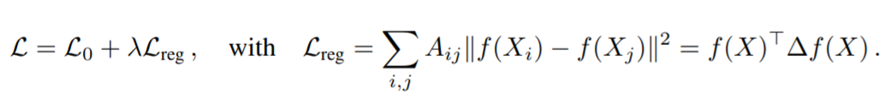

<head>
    
    
</head>

>提示：在github中无法正常显示公式，download repo到本地用markdown打开可以正常显示，也可以使用[GitHub with MathJax](https://chrome.google.com/webstore/detail/mathjax-plugin-for-github/ioemnmodlmafdkllaclgeombjnmnbima/related)插件来解决此问题

# GNN
## [Graph Matching Networks for Learning the Similarity of Graph Structured Objects](https://arxiv.org/pdf/1904.12787.pdf)
这篇文章作者在abstruct里面明确说了文章干了2件事情
> #如何将structure形式的sample转换为vector的representatio，并且使用此vector做一些similarity度量
> #作者提出了Graph Matching Network，这个网络结构输入的是一个pair的graph stucture sample，直接计算两者的similarity 
在看这篇文章的时候，个人觉得有几篇GNN的文章是必须要看的，这样才能把GNN的来龙去脉弄清楚，不至于对NLP中的GNN(GCN一窍不通)
## [SEMI-SUPERVISED CLASSIFICATION WITH GRAPH CONVOLUTIONAL NETWORKS](https://openreview.net/pdf?id=SJU4ayYgl)
在看这篇文章之前，首先要明确，图这种数据结构，一般都有有向图和无向图。图包括节点和边(nodes and edge)，假设一幅图有N个节点，则使用一个adjecency matrix可以表示N个节点之间的相互连接情况，一般情况下，adjancency matrix都是一些0,1的mask matrix，1的位置表示节点之间有连接，0表示没有连接，无向图的adjacency matrix都是对称的，而有向图却不是。传统方法中，训练图结构的Loss函数一般都是包括两项，如下面公式所示

其中，$L_0$是大图中，带有label位置的loss，$L_{reg}$是正则化项，直白的理解是$f(.)$函数需要把图中相邻节点隐射到一个比较接近的矢量空间中， $X$是节点，$A_{ij}$是adjacency matrix的$i$$j$个item。这篇文章算是把DeepLearning引入图网络的一个很早且意义重大的工作，主要有2点比较突出的贡献
> #介绍了一种可以直接对图网络进行建模的神经网络结构，可以把图中的节点信息和与其相连节点，边的信息柔和成一个矢量表征的方法，这样便于后续objective loss的计算
> #探索了GNN建模后，针对图中部分标注数据，可以做到有对无标注图部分信息表征的能力，对图网络进行半监督训练的一种方法