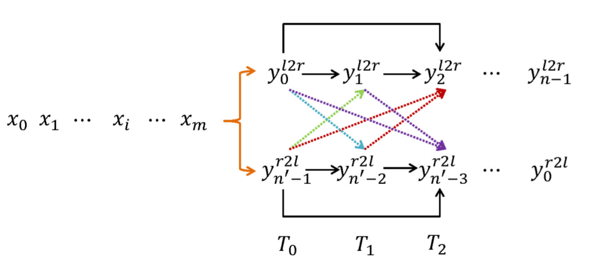
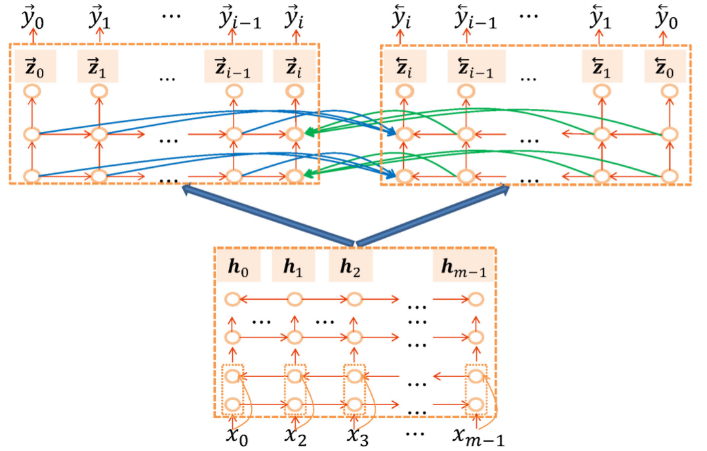
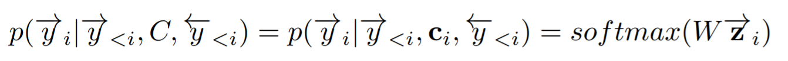
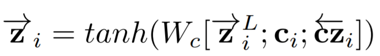
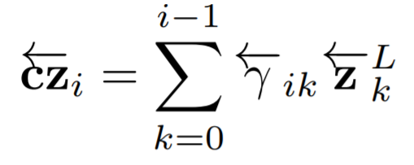
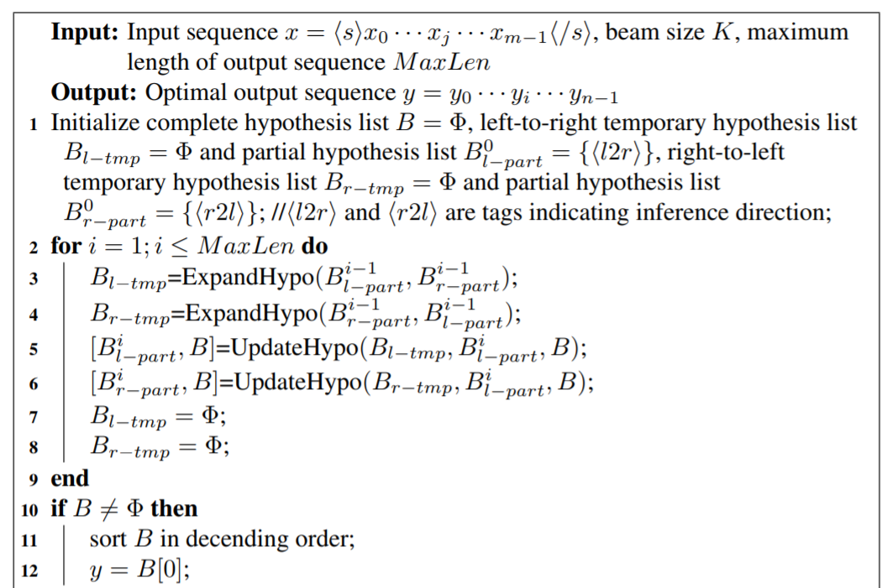
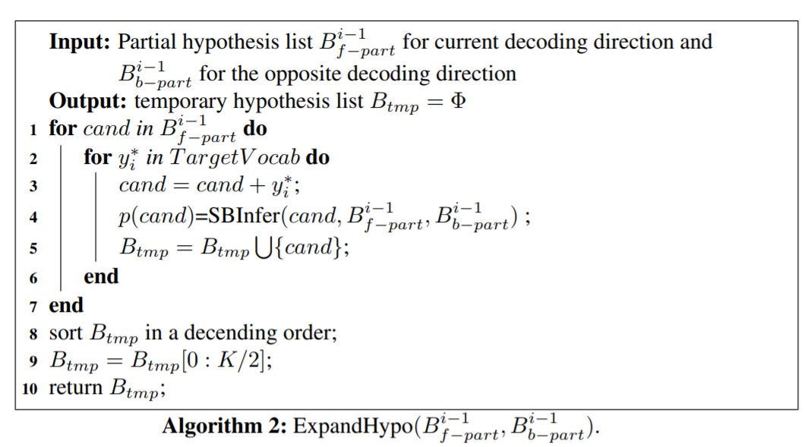
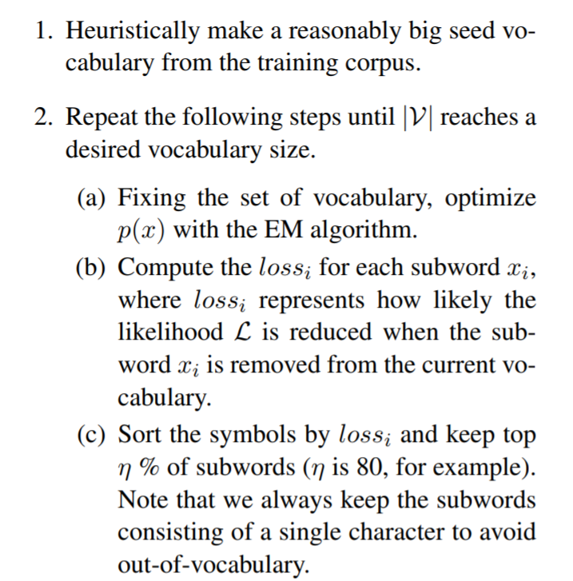
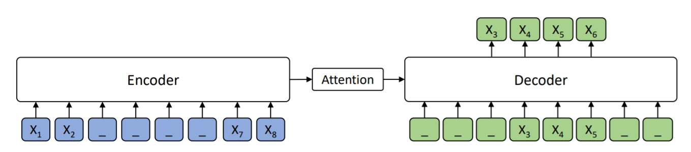

<head>
    
    
</head>

>提示：在github中无法正常显示公式，download repo到本地用markdown打开可以正常显示，也可以使用[GitHub with MathJax](https://chrome.google.com/webstore/detail/mathjax-plugin-for-github/ioemnmodlmafdkllaclgeombjnmnbima/related)插件来解决此问题

# [Synchronous Bidirectional Inference for Neural Sequence Generation](https://arxiv.org/pdf/1902.08955.pdf)
这是一篇挺有意思的文章，做了很多人都想做的在decoder使用双向信息的事情，但是这篇文章不同于用双边信息夹需要预测的token，具体的过程如下

其中正向的token从0 -> n-1；反向的token是从n'-1 -> 0，并且其中n与n'实际上是不同的。其表示正向模型解码后的token数目和反向模型的token数目实际上可能是不相同的。正向的0表示T0的token，反向的n'-t表示的是反向模型的T0的token，这跟我们所期望的双向实际上还是有一些区别的，这个模型会使得起始阶段的不确定性都比较大，随着模型往中间走，信息才开始变得越来越确定；而我们通常期望的双向，从模型起始阶段，正向即使不确定，但是反向模型编码了很长的历史了，仍然可以获得很确定的信息，但是那样子的双向模型便要求正向和反向模型长度一致，这个无法保证的，文章中这样设计双向，可以免去这个burden。
我们以LSTM为例子，观察模型是如何进行训练的，起算法过程可以表示为

最终的token预测公式表示为

其中$C$($c_i$)表示从encoder做attention得到的ctx信息，对于第i个token，模型有正向的$y_0$ \~ $y_{i-1}$的自回归信息，同时会对反向的$y_0’$ \~ $y_{i-1}’$ 编码的LSTM做attention，承接上面的公式，$\vec z_i$的计算公式表示为

最后我们再来看一下模型的界面逻辑，首先我们给出界面框架，然后再看一些解码的细节

其中比较关键的两个步骤就在于ExpandHypo()和UpdateHypo()两个函数，其中ExpandHypo()函数接受从左到右的nbest输入和从右到左的nbest输入，假设此时nbest=K，则共有$K$\*$K$种路径组合，然后送入模型，得到$K$\*$K$\*$V$个路径分数，得到$B_{l_tmp}$和$B_{r_tmp}$，然后送入进行裁剪，具体算法表示为

可以看出，正向只裁剪出$K/2$的，反向也裁剪$K/2$的路径，两者拼到一起，正向和反向模型均能够得到$K$个路径。而UpdateHypo()跟普通beamsearch一样

# [Subword Regularization: Improving Neural Network Translation Models with Multiple Subword Candidates](https://arxiv.org/pdf/1804.10959.pdf)
Google一位老铁搞的sentencepiece，最近一直在想解决Deocder端的过拟合问题，做了一个子词+字的random组合，非常土，机缘巧合，居然看到18年居然有人已经做过此类事情，不过做得更加系统，这玩意就是小有名气的sentence piece.
文章的出发点非常的make sence，BPE已经是我们非常常规的一种分词方法了，作者认为BPE本身的分词是多种可能的，但是我们仅仅取其一种分词法，实际上并不好，这种分词应该有多个候选，并且应该在训练过程中on-the-fly进行，而不是事先就定好。文章的一个重点工作在于，引入了small piece的unigram-langugage model来使得整个分词更加好。
> 举个简单例子，中文句子“北京 天安门 广场”，可以有另外一种候选为 “北京 天安门 广 场”

具体算法为

其中的$loss_i$由一个训练的uniform language model来进行计算

# [MASS: Masked Sequence to Sequence Pre-training for Language Generation](https://arxiv.org/pdf/1905.02450.pdf)
这篇文章可以看作是BERT-pretrain和GPT-pretrain的一个中间版本，其原理图表示为：

当其Encoder中间扣掉1个时，类似BERT，当其Encoder全部扣掉，类似GPT了
