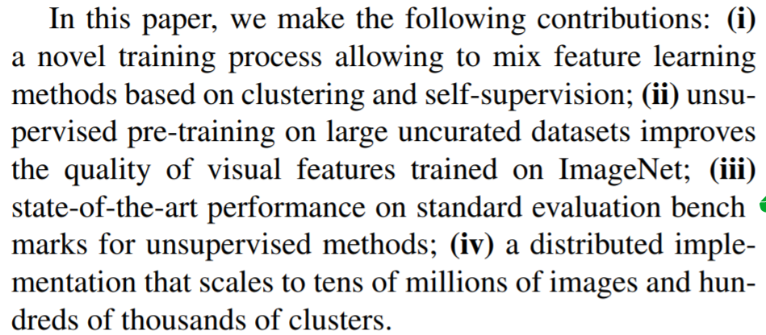

<head>
    
    
</head>

>提示：在github中无法正常显示公式，download repo到本地用markdown打开可以正常显示，也可以使用[GitHub with MathJax](https://chrome.google.com/webstore/detail/mathjax-plugin-for-github/ioemnmodlmafdkllaclgeombjnmnbima/related)插件来解决此问题

# [Leveraging Large-Scale Uncurated Data for Unsupervised Pre-training of Visual Features](https://arxiv.org/pdf/1905.01278.pdf)

Facebook的self-supervised论文，这篇论文是在之前[Deepcluster](https://arxiv.org/pdf/1807.05520.pdf)基础上面的一个暴力版本，训练数据从imagenet的扩充到 YFCC100M，网络结构也从alexnet扩充到vgg-16。这类自聚类，在用网络预测聚类标签，再聚类的方式总觉得其天花板比较低。whatever，这篇文章作者提出的几点贡献我还是比较认可，虽然效果不咋滴。

# [DRIT++: Diverse Image-to-Image Translation via Disentangled Representations](https://arxiv.org/pdf/1905.01270.pdf)
这是一篇image2image，而且不需要平行image的工作，作者声称学习到了disentangled representation来进行高质量的图像生成。
文章介绍并且对比了主流的一些unsupervised image2image的方法和原理图为：

这些Image2image的方法后续可以做一个专题调研了。不过文章有一个词$cross-cycle consistency$，在很多类似的文章中都看过，这个词貌似最初来源的[论文](https://arxiv.org/pdf/1703.10593.pdf)

# [Disentangling Factors of Variation Using Few Labels](https://128.84.21.199/pdf/1905.01258.pdf)

这篇文章的一个出发点是为了验证另外一篇[论文](https://arxiv.org/pdf/1811.12359.pdf)的坑。作者任务，无监督学习过程中定义的目前，需要根据其下游任务来进行确定，特别是当我们一直下游任务，在无监督学习representation过程中，用非常少量的有监督数据，作为无监督学习的一个辅助手段，能够非常显著地提升模型disentanged representation

# [Scaling and Benchmarking Self-Supervised Visual Representation Learning](https://128.84.21.199/pdf/1905.01235.pdf)

Facebook家的，工程性论文，验证了self-supervised训练方法[$Jigsaw$](https://arxiv.org/pdf/1603.09246.pdf)和[$Colorization$](https://arxiv.org/pdf/1603.08511.pdf)，并且验证了增加模型容量和数据量，从实验效果来看，在imagenet+linear分类效果并不怎么好

# [Self-supervised Sequence-to-sequence ASR using Unpaired Speech and Text](https://arxiv.org/pdf/1905.01152.pdf)

这里面又出现了cycle consistency的概念，先看看这篇我能做的原理图

类似对偶学习了，txt->tts->asr->txt', fbank->asr->tts->fbank'。并且这个过程都有提到回传，并且使用cycle-consistency的一个约束框架，这篇文章可以细读看看，有点不足的是，这篇文章的实验做得有点水，数据太少，结果不太可信。

# [lottery tickets](https://128.84.21.199/pdf/1905.01067.pdf)
这是一篇今年ICLR的文章一个分析版本，关于模型剪枝和压缩的，还挺有意思的