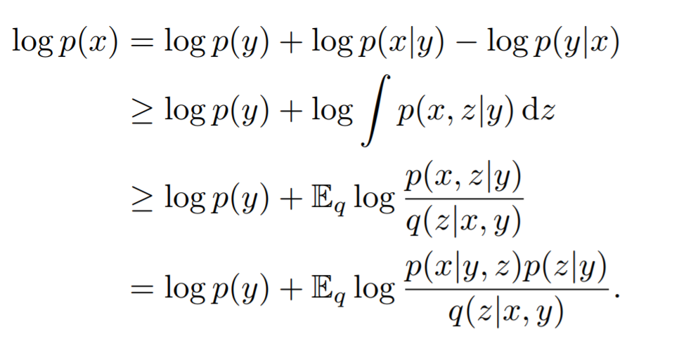
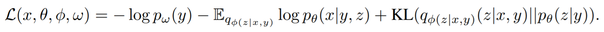

<head>
    
    
</head>

>提示：在github中无法正常显示公式，download repo到本地用markdown打开可以正常显示，也可以使用[GitHub with MathJax](https://chrome.google.com/webstore/detail/mathjax-plugin-for-github/ioemnmodlmafdkllaclgeombjnmnbima/related)插件来解决此问题

# [DISENTANGLING CONTENT AND STYLE VIA UNSUPERVISED GEOMETRY DISTILLATION](https://arxiv.org/pdf/1905.04538.pdf)
商汤出的一篇用Unsuperivsed方式将content和style给disentangle开来。网络使用了2个branch来分别处理content和style。这篇文章出发点非常暴力，直接将VAE的一个latent variable给拆分为2个，推导公式为：

本身VAE可能只有1个z，这里强制引入一个随机变量y，第一行公式直接略掉$logp(y|x)$，后续再用jessen不等式，最后就变成VAE的ELBO的公式推导了，不过多出来一个$y$的prior，以及vae的各项公式多了对$y$的condition

最终的loss function写为：

其中的prior loss这块有比较多的trick，后续如果需要做合成之类的，感觉这是一个非常不错的follow对象

