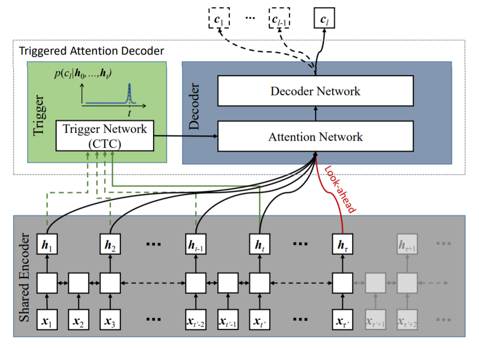
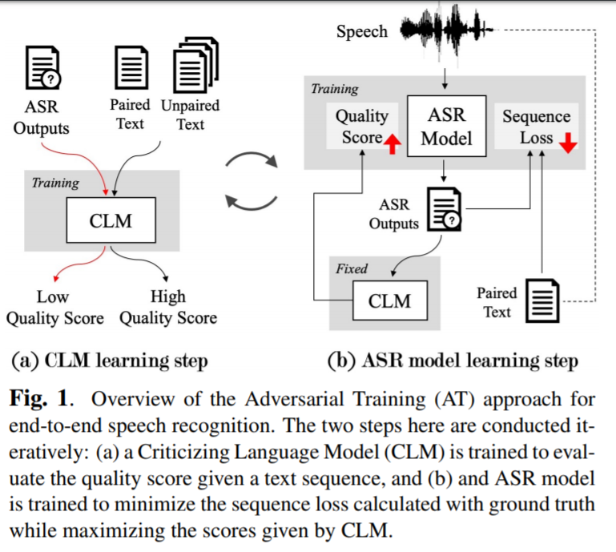

<head>
    
    
</head>

>提示：在github中无法正常显示公式，download repo到本地用markdown打开可以正常显示，也可以使用[GitHub with MathJax](https://chrome.google.com/webstore/detail/mathjax-plugin-for-github/ioemnmodlmafdkllaclgeombjnmnbima/related)插件来解决此问

# [SELF-ATTENTION ALIGNER: A LATENCY-CONTROL END-TO-END MODEL FOR ASR USING SELF-ATTENTION NETWORK AND CHUNK-HOPPING](https://arxiv.org/pdf/1902.06450.pdf)
中科院徐波老师做的在线化做ED的文章，主要思想是把utterence按chunk进行拆分，并且训练目标是CTC-like的自回归目标，有一个RNA模块来确定Decoder端是否需要pop一个新的token，做工程可以参考

# [TRIGGERED ATTENTION FOR END-TO-END SPEECH RECOGNITION](https://www.merl.com/publications/docs/TR2019-015.pdf)
也是在线化的一篇文章，其网络结构图表示为

有一个Trigger网络来预测是否Decoder要输出下一个token，Encoder往前多看几帧满足延时需求

# [SELF-ATTENTION NETWORKS FOR CONNECTIONIST TEMPORAL CLASSIFICATION IN SPEECH RECOGNITION](https://sci-hub.tw/10.1109/ICASSP.2019.8683302)
这篇文章是对ED Loss的一个 小改动，作者出发点任务loss在前面的token的权重应该高一些，这样来缓解模型解码过程中的误差累积，出发点没问题，不过感觉这个方法有点弱，从实验结果来看，提升也很微弱

# [https://arxiv.org/pdf/1901.10055.pdf](https://arxiv.org/pdf/1901.10055.pdf)
亚马逊做的，使用self-attention做CTC训练，emm，效果并不是特别好

# [Investigation of Modeling Units for Mandarin Speech Recognition using DFSMN-CTC-SMBR](https://www.researchgate.net/publication/332143297_Investigation_of_Modeling_Units_for_Mandarin_Speech_Recognition_Using_Dfsmn-ctc-smbr)
对中文CTC建模单元的一篇实验综述性文章，最终的结论是中文使用字+sylable的方式可能更加适合

# [ADVERSARIAL TRAINING OF END-TO-END SPEECH RECOGNITION USING A CRITICIZING LANGUAGE MODEL](https://arxiv.org/pdf/1811.00787.pdf)
使用对抗学习来做asr，其网络结构表示为

跟训练GAN很类似，generator就是ASR识别器，discriminator就是一个语言模型。先不说这篇文章的结果，感觉使用这个思路做std还是一个可以尝试的技术方向

# [COMPONENT FUSION: LEARNING REPLACEABLE LANGUAGE MODEL COMPONENT FOR END-TO-END SPEECH RECOGNITION SYSTEM](http://lxie.nwpu-aslp.org/papers/2019ICASSP-ChanghaoShan-LM.pdf)
这篇文章介绍了LM与LAS ED模型的shallow fusion, deep fusion, cold fusion和文章提出的componet fusion，值得看看

# [END-TO-END CONTEXTUAL SPEECH RECOGNITION USING CLASS LANGUAGE MODELS AND A TOKEN PASSING DECODER](https://arxiv.org/pdf/1812.02142.pdf)
将上下文信息简单高效地引入近E2E的识别系统中，是个人认为比较适合落地使用的一个方向，可以观察参考一下

# [LANGUAGE MODEL INTEGRATION BASED ON MEMORY CONTROL FOR SEQUENCE TO SEQUENCE SPEECH RECOGNITION](https://arxiv.org/pdf/1811.02162.pdf)
在ED模型基础上面，使用语言模型做transfor learning的事情

# [TRANSFER LEARNING OF LANGUAGE-INDEPENDENT END-TO-END ASR WITH LANGUAGE MODEL FUSION](https://arxiv.org/pdf/1811.02134.pdf)
ED模型基础上，使用外置语言模型做transfor learning的事情

